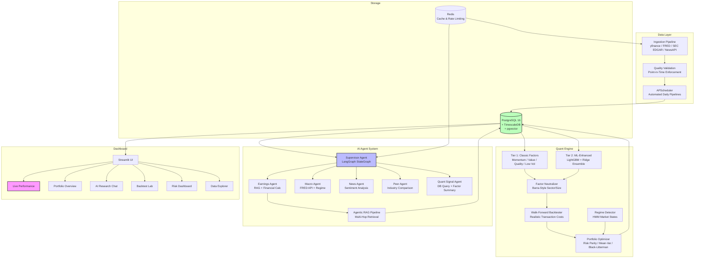

# FinSight

[](https://github.com/YOUR_USERNAME/finsight/actions/workflows/test.yml)
[](https://www.python.org/downloads/)
[](LICENSE)

**AI-Powered Investment Research & Quantitative Analysis Platform**

An end-to-end financial data platform that combines multi-factor quantitative analysis, multi-agent AI research (LangGraph + Claude), and a live performance tracking dashboard. Built to demonstrate production-grade data engineering, quantitative finance, and AI agent architecture.

<!-- Screenshots placeholder -->
<!--  -->

---

## Architecture



## Tech Stack

| Layer | Technology |
|-------|-----------|
| Language | Python 3.11+ |
| Database | PostgreSQL 16 + TimescaleDB + pgvector |
| Cache | Redis 7 |
| Quant | scikit-learn, LightGBM, cvxpy, statsmodels, scipy |
| AI/LLM | Claude API (Anthropic), LangGraph, LangChain |
| RAG | pgvector (hybrid search), pdfplumber, unstructured |
| Dashboard | Streamlit, Plotly, matplotlib |
| DevOps | Docker Compose, GitHub Actions, pytest, ruff, mypy |

## Quick Start

### Prerequisites

- Python 3.11+
- Docker & Docker Compose (for database; optional for demo mode)

### Option A: Full Setup (with Database)

```bash
# 1. Clone and configure
git clone <repo-url> && cd finsight
cp .env.example .env
# Edit .env with your API keys (ANTHROPIC_API_KEY, FRED_API_KEY, etc.)

# 2. Start infrastructure
docker-compose up -d
# Brings up PostgreSQL 16 (TimescaleDB + pgvector) and Redis 7

# 3. Install Python dependencies
python -m venv .venv
source .venv/bin/activate
pip install -e ".[dev]"

# 4. Initialize database
python scripts/setup_db.py

# 5. Load initial data
python scripts/seed_data.py --quick     # Fast: 10 symbols
# python scripts/seed_data.py           # Full: S&P 500

# 6. Launch dashboard
streamlit run src/dashboard/app.py
```

### Option B: Demo Mode (No Database Required)

```bash
# 1. Clone and install
git clone <repo-url> && cd finsight
python -m venv .venv
source .venv/bin/activate
pip install -e ".[dev]"

# 2. Launch dashboard (uses synthetic sample data)
streamlit run src/dashboard/app.py

# 3. Generate a standalone tearsheet
python scripts/generate_tearsheet.py

# 4. Generate an AI research report
python scripts/generate_report.py AAPL
```

The dashboard runs with synthetic data when no database is available. All 6 pages are fully functional in demo mode.

### Running Tests

```bash
pytest                          # Run all 200+ tests
pytest --cov=src               # With coverage report
ruff check src/ tests/         # Lint
mypy src/                      # Type check
```

## Dashboard Pages

| Page | Description |
|------|-------------|
| **Live Performance** | Institutional-grade performance report: equity curve (IS vs OOS), metrics table, monthly heatmap, factor attribution, drawdown, rolling Sharpe |
| **Portfolio Overview** | Holdings table with P&L, sector allocation pie, equity curve vs benchmark, rolling 63-day metrics |
| **AI Research Assistant** | Chat interface for multi-agent stock analysis. Loads pre-generated reports or shows placeholder |
| **Backtest Lab** | Configure factor selection + weights, run backtests, view equity curve, drawdown, monthly returns heatmap |
| **Risk Dashboard** | VaR/CVaR/Beta metrics, drawdown analysis, return distribution, sector concentration, correlation heatmap, rolling risk |
| **Data Explorer** | Browse market data (OHLCV charts), factor signals (distribution + ranking), macro indicators, data quality dashboard |

## Project Structure

```
finsight/
├── src/
│   ├── config/              # Pydantic settings, logging
│   ├── data/                # Ingestion pipeline, quality validation
│   │   ├── ingestion/       # Market (yfinance), fundamentals (FMP), macro (FRED)
│   │   └── quality/         # Validators, cleaners, monitors
│   ├── quant/               # Quantitative analysis engine
│   │   ├── factors/         # 10 classic factors + composite
│   │   ├── backtest/        # Walk-forward backtester + tearsheet
│   │   ├── portfolio/       # Optimization, risk (VaR/CVaR/Beta)
│   │   └── signals/         # Signal generation & combination
│   ├── agents/              # AI agent system
│   │   ├── supervisor.py    # LangGraph StateGraph router
│   │   ├── aggregator.py    # Score aggregation + conflict detection
│   │   ├── tools/           # Agent tools (SEC, FRED, DB query)
│   │   ├── rag/             # Agentic RAG pipeline (chunk → embed → retrieve)
│   │   ├── prompts/         # Structured prompt templates
│   │   └── schemas/         # Pydantic output schemas
│   └── dashboard/           # Streamlit UI
│       ├── app.py           # Main entry point
│       ├── sample_data.py   # Synthetic data for demo mode
│       └── pages/           # 6 dashboard pages
├── tests/                   # 200+ pytest tests
├── scripts/
│   ├── seed_data.py         # Database seeding
│   ├── generate_report.py   # AI research report CLI
│   ├── generate_tearsheet.py # Standalone HTML tearsheet
│   ├── daily_update.py      # Daily pipeline (prices → factors → signals)
│   └── paper_trade.py       # Paper trading signal generator
├── docs/
│   ├── architecture.md      # System architecture + data flow
│   ├── data_dictionary.md   # All tables, fields, sources
│   ├── backtesting_methodology.md  # Statistical methods, anti-overfit
│   └── agent_design.md      # AI agent architecture
├── .github/workflows/test.yml  # CI: lint → typecheck → test
├── docker-compose.yml       # PostgreSQL + TimescaleDB + Redis
└── pyproject.toml           # Dependencies & tool config
```

## Key Features

### Data Platform
- Multi-source financial data ingestion (yfinance, FRED, SEC EDGAR, NewsAPI)
- Point-in-time data enforcement to prevent look-ahead bias
- 7 automated quality checks with monitoring dashboard
- TimescaleDB-optimized time-series storage

### Quantitative Engine
- 10 classic academic factors (momentum, value, quality, low volatility)
- Cross-sectional z-scoring with ±3σ winsorization
- Walk-forward backtesting with realistic transaction costs (commission + spread + impact)
- Portfolio optimization (equal-weight, risk parity, mean-variance)
- Rule-based market regime detection with factor tilts
- Performance tearsheet generator (standalone HTML)

### AI Agent System
- 5 specialized agents: Earnings, Macro, News, Quant Signal, Peer Comparison
- LangGraph supervisor with query classification and parallel fan-out
- Agentic RAG with hybrid retrieval (semantic + BM25 + RRF fusion)
- Weighted aggregation with conflict detection
- Professional HTML research reports with structured Pydantic outputs

### Dashboard (6 Pages)
- Interactive charts with Plotly (dark theme, professional styling)
- Live performance tracking with backtest vs. out-of-sample comparison
- Configurable backtest lab with factor weight sliders
- Risk analytics (VaR, CVaR, factor exposure, stress analysis)
- AI research assistant with chat interface
- Data quality monitoring dashboard

### Paper Trading & Automation
- Daily update pipeline: `python scripts/daily_update.py`
- Paper trade signal generator: `python scripts/paper_trade.py`
- Snapshot recording for track record building
- Cron-schedulable for fully automated operation

## Documentation

- [Architecture](docs/architecture.md) — System design, data flow, deployment
- [Data Dictionary](docs/data_dictionary.md) — All tables, fields, sources, update frequencies
- [Backtesting Methodology](docs/backtesting_methodology.md) — Statistical methods, anti-overfitting measures
- [Agent Design](docs/agent_design.md) — AI agent architecture, prompts, scoring weights

## Development

```bash
# Run tests
pytest

# Run with coverage
pytest --cov=src --cov-report=term-missing

# Lint
ruff check src/ tests/ scripts/

# Type check
mypy src/

# Generate tearsheet
python scripts/generate_tearsheet.py --output reports/tearsheet.html

# Daily update pipeline
python scripts/daily_update.py --quick

# Paper trading
python scripts/paper_trade.py --dry-run
```

## License

MIT

---

> **Disclaimer**: FinSight is an AI-powered research and analysis tool for educational and informational purposes only. It does not constitute investment advice. Past performance does not guarantee future results.
